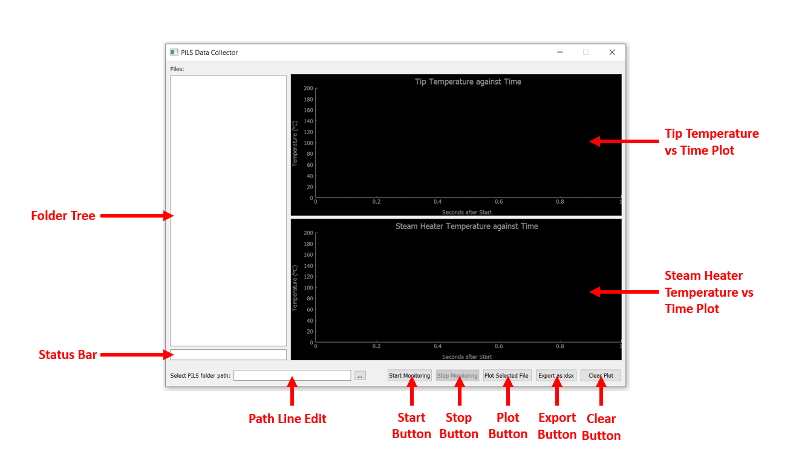

# Data Collection Application for PILS 
This repository contains the data collection application for Particle into Liquid Sampler (PILS) Model 4001 manufactured by Brechtel. 

The applicaiton is designed to improve the access to the run data of the PILS, and serves as part of a prototype for a larger automated data collection system. The main functions of this application include live data visualization, plot data log of past runs and convert raw data DAT files into XLSX files.  

In additon, `conti_dummy_data.py` and `dummy_data.py` were written to generate dummy data for testing and dubugging.

# GUI Descriptions

The GUI contains the following objects as labelled:
1. **Folder Tree** - showing the data files in the selected directory 
2. **Status Bar** - showing the status of the applicaiton
3. **Path Line Edit** - showing the path to the selected directory
4. **Start Button** - starting the live plot process
5. **Stop Button** - stopping the live plot process
6. **Plot Button** - plotting past run data files 
7. **Export Button** - exporting the selected DAT file into XLSX file
8. **Clear Button** - clearing the plots in the plotWidgets
9. **Tip Temp vs Time Plot** - plotWidgets plotting the tip temperature against time in seconds
10. **Steam Heater Temp vs Time Plot** - plotWidgets plotting the steam heater temperature against time in seconds 

# Installation
Before using the application, `Python3` must first be installed which can be found [here](https://www.python.org/downloads/).  
After that, install the necessary dependencies by running the following commands in the terminal:  
`pip3 install numpy`  
`pip3 install pandas`  
`pip3 install pyqt5`  
`pip3 install pyqtgraph`  

To run the program, `cd` to the directory which contains the the `Ui_scripts.py` and the `main.py` files in the terminal and run the `python main.py` command.  

# Operation
**Select the data file directory (MUST DO THIS FIRST)**  
After running the `main.py` script, the GUI will appear.  
To begin with, click the `tool button` to select the directory which contains the data files.  

**Start live plotting**  
To start the live plot process, select the data file of the current run in the `folder tree` then click the `Start Monitoring` button to begin the process once the data file is selected.  

**Stop live plotting**  
To stop the live plot process, click the `Stop Monitoring` button.  

**Plot past run data**
To plot the past run data, select the data file of the past run in the `folder tree` and click the `Plot Selected File` button.  

**Export as XLSX file**  
To export the data file into XLSX file, select the data file in the `folder tree` and click the `Export as xlsx` button.  

**Clear plot**  
To clear the plots from past run, click the `Clear Plot` button. 
